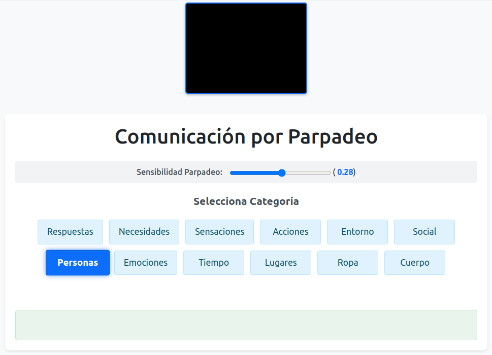

# Assistive Blink Control - Proof of Concept (PoC)

 <!-- ¡Asegúrate de añadir un archivo LICENSE con la licencia MIT! -->

Una aplicación web experimental (Prueba de Concepto) que demuestra cómo se puede usar la detección de parpadeos a través de la webcam para interactuar con una interfaz de comunicación asistencial básica. Permite a los usuarios navegar por categorías y seleccionar palabras predefinidas utilizando únicamente el parpadeo.

**Proyecto en GitHub:** [https://github.com/soyunomas/assistive-blink-control-poc/](https://github.com/soyunomas/assistive-blink-control-poc/)

**Demo en vivo:** [https://soyunomas.github.io/assistive-blink-control-poc/parpadeo.html](https://soyunomas.github.io/assistive-blink-control-poc/parpadeo.html)

*(Nota importante: Se requiere una webcam y permitir el acceso a la cámara en el navegador para que la demo funcione. Se recomienda usar HTTPS para mayor compatibilidad y seguridad, aunque la demo pueda funcionar en localhost o `file://`)*

---

## ✨ Características Clave

*   **Control por Parpadeo:** Utiliza la webcam y **MediaPipe FaceLandmarker** para detectar los parpadeos del usuario en tiempo real.
*   **Navegación Jerárquica Simple:**
    *   Permite seleccionar entre diferentes categorías de palabras (Respuestas, Necesidades, Sensaciones, etc.).
    *   Dentro de una categoría, permite seleccionar palabras específicas.
    *   Incluye una opción "Volver Atrás" para regresar de la lista de palabras a la lista de categorías.
*   **Interacción Diferenciada por Duración del Parpadeo:**
    *   **Parpadeo Corto:** Funciona como "Siguiente", moviendo el resaltado al siguiente ítem en la lista activa (categoría o palabra).
    *   **Parpadeo Largo:** Funciona como "Seleccionar", eligiendo el ítem resaltado (entra en una categoría, selecciona una palabra final, o activa la opción "Volver Atrás").
*   **Feedback Visual Claro:**
    *   Resalta visualmente el elemento actualmente enfocable (`.selected-item-highlight`).
    *   Muestra la palabra final seleccionada en un área prominente (`#selected-word-display`).
    *   Muestra el feed de la cámara en un recuadro fijo para que el usuario pueda verificar su posición y la detección.
*   **Sensibilidad de Detección Ajustable:**
    *   Incluye un slider (`#sensitivity-slider`) que permite al usuario ajustar el umbral de detección de parpadeo (Eye Aspect Ratio - EAR). Esto ayuda a adaptar la aplicación a diferentes usuarios, condiciones de iluminación o fatiga.
*   **Interfaz Limpia y Adaptable:**
    *   Diseño basado en **Bootstrap 5** para una apariencia moderna y consistencia.
    *   Incluye reglas CSS (`@media`) para mejorar la usabilidad en pantallas más pequeñas (móviles y tablets).
*   **Manejo Básico de Errores:** Muestra mensajes al usuario si no se detecta la cámara, se deniegan los permisos, o falla la inicialización de MediaPipe.

## ⚙️ Cómo Funciona Detalladamente

1.  **Inicialización:** Al cargar la página (`DOMContentLoaded`), la aplicación inicializa la interfaz, configura el slider de sensibilidad y llama a `createFaceLandmarker`.
2.  **Creación del Detector Facial:** Se instancia `FaceLandmarker` de `@mediapipe/tasks-vision` (versión `0.10.22-rc.20250304` en el código), configurado para ejecutarse en modo `VIDEO` y detectar una sola cara, preferiblemente usando la GPU (`delegate: "GPU"`).
3.  **Acceso a la Cámara:** Utiliza `navigator.mediaDevices.getUserMedia` para solicitar acceso a la webcam, pidiendo idealmente una resolución de 640x480 y la cámara frontal (`facingMode: 'user'`). Gestiona posibles errores comunes (`NotAllowedError`, `NotFoundError`, etc.).
4.  **Inicio del Procesamiento:** Una vez que el stream de video está listo (`loadeddata`), se inicia el bucle de predicción `predictWebcam` usando `requestAnimationFrame`.
5.  **Bucle de Detección (`predictWebcam`):**
    *   En cada frame, se pasa el frame actual del video a `faceLandmarker.detectForVideo()`.
    *   Si se detectan landmarks faciales, se extraen las coordenadas 3D de los puntos clave de ambos ojos (usando `LEFT_EYE_INDICES` y `RIGHT_EYE_INDICES`).
    *   Se calcula el **Eye Aspect Ratio (EAR)** para cada ojo usando la distancia euclidiana entre puntos verticales y horizontales. El EAR promedio de ambos ojos se utiliza como métrica principal. `EAR = (DistanciaVertical1 + DistanciaVertical2) / (2 * DistanciaHorizontal)`. Un EAR bajo significa que el ojo está más cerrado.
    *   **Lógica de Detección de Parpadeo:**
        *   Si `avgEAR < EYE_AR_THRESH` (el umbral ajustado por el slider): Se incrementa un contador (`blinkCounter`). Se marca que un parpadeo está en curso (`isBlinking = true`).
        *   Si `avgEAR >= EYE_AR_THRESH` (ojo abierto) y `isBlinking` era `true`: Se evalúa `blinkCounter`:
            *   Si `blinkCounter > LONG_BLINK_THRESHOLD` (actualmente 12 frames): Se interpreta como **PARPADEO LARGO (Selección)**. La acción depende del modo (`CATEGORY` o `WORD`): seleccionar categoría y mostrar palabras, seleccionar palabra final y mostrarla (volviendo luego a categorías), o activar "Volver Atrás".
            *   Si `blinkCounter >= EYE_AR_CONSEC_FRAMES` (actualmente 2 frames) pero no es largo: Se interpreta como **PARPADEO CORTO (Navegación)**. Se avanza al siguiente elemento en la lista activa (`selectedCategoryIndex` o `selectedWordIndex` se incrementan modularmente).
        *   El contador y el flag `isBlinking` se resetean después de detectar y procesar el final de un parpadeo.
6.  **Actualización de la Interfaz:** Las funciones `displayCategories()` y `displayWords()` se llaman después de detectar un parpadeo para actualizar qué lista se muestra y qué elemento está resaltado. La función `scrollIntoView()` se usa para mantener visible el elemento seleccionado. El texto seleccionado se muestra en `#selected-word-display`.
7.  **Optimización:** Se evita procesar el mismo frame de video múltiples veces comprobando `video.currentTime === lastVideoTime`.

## 🛠️ Tecnologías Utilizadas

*   **HTML5:** Estructura semántica del documento.
*   **CSS3:** Estilos personalizados (incluyendo `position: fixed`, `transform`, `transition`, `box-shadow`) y diseño adaptable (`@media` queries).
*   **Bootstrap 5.3.2:** Framework CSS/JS utilizado principalmente para layout (contenedor, centrado), componentes básicos (botones implícitos en los spans) y estilos generales. Se carga desde CDN.
*   **JavaScript (ES Modules):**
    *   Toda la lógica de la aplicación.
    *   Manipulación del DOM (creación de elementos, gestión de clases, actualización de contenido).
    *   Manejo de eventos (slider `input`, video `loadeddata`, `error`).
    *   Uso de APIs del navegador: `navigator.mediaDevices.getUserMedia`, `requestAnimationFrame`, `performance.now()`.
*   **MediaPipe Tasks Vision (`@mediapipe/tasks-vision@0.10.22-rc.20250304/+esm`):**
    *   Librería de Google para tareas de visión por computadora.
    *   Se utiliza `FaceLandmarker` para la detección de puntos clave faciales en tiempo real.
    *   Se carga directamente desde la CDN de `jsdelivr.net`.

## 🚀 Uso de la Demo

1.  Abre el enlace de la **[Demo en vivo](https://soyunomas.github.io/assistive-blink-control-poc/parpadeo.html)** en un navegador web moderno (se recomiendan las últimas versiones de Chrome, Firefox o Edge).
2.  **Requisitos:**
    *   Necesitas una **webcam** conectada y funcional.
    *   El navegador debe soportar `getUserMedia` y las tecnologías necesarias para MediaPipe (WebAssembly, WebGL).
3.  **Permisos:** Cuando el navegador lo solicite, **permite** que el sitio acceda a tu cámara. Si lo bloqueas accidentalmente, necesitarás ajustar los permisos del sitio en la configuración del navegador y recargar la página.
4.  **Interacción:**
    *   Una vez cargado, verás el video de tu cámara en la parte superior y la lista de categorías.
    *   **Mira directamente a la cámara.**
    *   Realiza un **parpadeo corto y natural** (cerrar y abrir los ojos rápidamente) para mover el resaltado azul (`selected-item-highlight`) al siguiente elemento de la lista.
    *   Realiza un **parpadeo largo** (mantén los ojos cerrados durante aproximadamente medio segundo o un poco más) para seleccionar el elemento resaltado.
    *   Si la detección no es fiable (detecta demasiados parpadeos o muy pocos), ajusta el slider de **"Sensibilidad Parpadeo"**:
        *   *Mover hacia la izquierda (valores más bajos)*: Requiere cerrar más los ojos para detectar el parpadeo (menos sensible).
        *   *Mover hacia la derecha (valores más altos)*: Detecta parpadeos más leves (más sensible). Encuentra el valor que mejor funcione para ti.
5.  **Navega:** Usa parpadeos largos para entrar en categorías, seleccionar palabras o volver atrás. Usa parpadeos cortos para ciclar entre las opciones disponibles. La palabra seleccionada aparecerá en el cuadro verde inferior.

## ⚠️ Limitaciones y Naturaleza PoC (Importante)

*   **Prueba de Concepto:** Esta aplicación es una demostración técnica y **no está diseñada ni probada para un uso asistencial real o crítico**. Es una exploración de la tecnología.
*   **Dependencia de Condiciones:**
    *   **Iluminación:** La precisión de MediaPipe y la detección de EAR pueden verse muy afectadas por la luz ambiental (demasiado oscura, demasiado brillante, contraluz).
    *   **Posición y Ángulo:** Funciona mejor cuando la cara está bien iluminada y relativamente de frente a la cámara. Movimientos bruscos o ángulos extremos pueden fallar.
    *   **Gafas:** Dependiendo del tipo de gafas y los reflejos, la detección de los ojos puede ser menos precisa.
*   **Variabilidad del Usuario:** La forma "normal" de parpadear, la forma de los ojos y la fatiga varían mucho entre personas. El ajuste de sensibilidad es crucial pero puede no ser suficiente para todos.
*   **Rendimiento:** El procesamiento de video en tiempo real con MediaPipe consume recursos de CPU y/o GPU. El rendimiento puede variar drásticamente según el hardware del dispositivo. En dispositivos de baja potencia, puede haber retrasos o baja tasa de frames.
*   **Falsos Positivos/Negativos:** Es posible que la aplicación detecte parpadeos que no ocurrieron (especialmente con mala iluminación o movimientos rápidos) o que no detecte parpadeos reales (si son muy rápidos o no lo suficientemente pronunciados según el umbral).
*   **Vocabulario Fijo:** Las categorías y palabras están codificadas directamente en el archivo JavaScript. No hay forma de personalizarlas a través de la interfaz.
*   **Sin Persistencia:** Cualquier selección se pierde al recargar la página.

## 💡 Posibles Mejoras Futuras

*   **Calibración por Usuario:** Una rutina inicial para ajustar automáticamente los umbrales de EAR y duración de parpadeo a cada individuo.
*   **Feedback Auditivo:** Añadir sonidos para confirmar la navegación y selección, mejorando la accesibilidad.
*   **Personalización del Vocabulario:** Permitir a los usuarios (o cuidadores) añadir/editar/eliminar categorías y palabras.
*   **Modo "Escritura Libre":** Explorar métodos para seleccionar letras individuales (p. ej., mediante escaneo de filas/columnas) para formar palabras personalizadas.
*   **Robustez Mejorada:** Investigar técnicas para mitigar el impacto de la iluminación variable, el uso de gafas y los diferentes ángulos de la cabeza.
*   **Detección de Otros Gestos:** Ampliar la interacción usando otros puntos faciales detectables por MediaPipe (movimiento de cejas, apertura de boca, etc.), si es apropiado para el caso de uso.
*   **Integración con Síntesis de Voz (TTS):** Hacer que la palabra seleccionada sea leída en voz alta.
*   **Mejoras de Accesibilidad (WCAG):** Realizar una auditoría y aplicar mejoras para cumplir con estándares de accesibilidad web.

## 📄 Licencia

Este proyecto está distribuido bajo la Licencia MIT. Consulta el archivo `LICENSE` en el repositorio para más detalles.

---

*Desarrollado por [soyunomas](https://github.com/soyunomas)*
